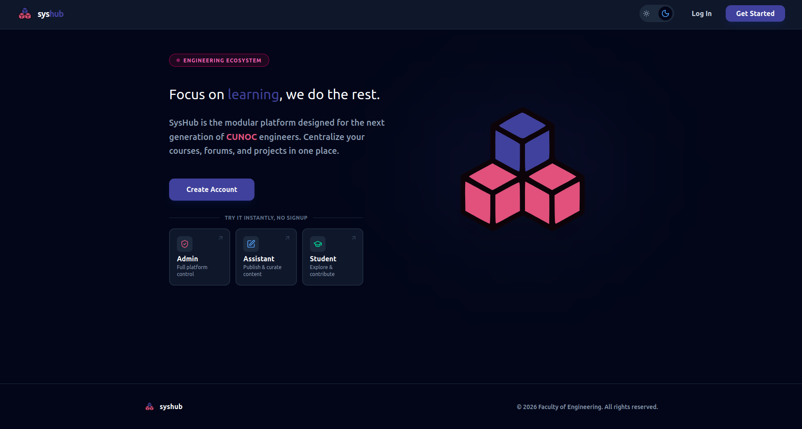

# SysHub — Backend

Academic social platform for the Computer Science and Systems Engineering program at USAC (CUNOC). Students, teaching assistants, and admins share projects, publish technical articles, and manage the academic course catalog in one place.

**Live API:** `https://syshub-backend.onrender.com`
**Frontend repo:** [https://github.com/cristian-ves/syshub-frontend](#)

> Note: the backend runs on Render's free tier and spins down after inactivity. The first request after idle time can take 30–60 seconds to wake up.


---

## Features

- **JWT authentication** with role-based access control (Admin / Assistant / Student)
- **Password recovery flow** via email, with short-lived signed tokens
- **Project repository**: students submit projects with GitHub links, tags, and file attachments (Cloudinary), filterable by study plan, semester, technical area, tag, or course
- **Article platform**: assistants and admins publish Markdown articles tied to specific courses, with comments, upvote/downvote, and a favorites system for readers
- **Academic catalog**: study plans, semesters, technical areas, and courses, seeded from the real USAC CUNOC curriculum
- **Admin user management**: create, edit, disable, and reset credentials for any user

---

## Tech Stack

| Layer | Technology |
|---|---|
| Language | Java 21 |
| Framework | Spring Boot 4.0.6 |
| Security | Spring Security + JWT (jjwt 0.11.5) |
| Persistence | Spring Data JPA, PostgreSQL |
| File storage | Cloudinary |
| Email | Spring Mail (SMTP via Mailtrap) |
| Build | Maven |
| Deployment | Docker (multi-stage build) on Render |
| Database hosting | Neon (serverless Postgres) |

---

## Roles & Permissions

| Capability | Student | Assistant | Admin |
|---|:---:|:---:|:---:|
| Browse projects & articles | ✅ | ✅ | ✅ |
| Submit a project | ✅ | ✅ | ✅ |
| Comment, vote, and favorite articles | ✅ | ✅ | ✅ |
| Mark a project as featured | ❌ | ✅ | ✅ |
| Publish an article | ❌ | ✅ | ✅ |
| Manage users (create/edit/delete) | ❌ | ❌ | ✅ |

---

## API Reference

Base path: `/api/v1`. All endpoints except `auth/register`, `auth/login`, `auth/forgot-password`, and `auth/reset-password` require a `Bearer` JWT in the `Authorization` header.

### Auth

| Method | Endpoint | Description | Auth |
|---|---|---|---|
| POST | `/auth/login` | Authenticate with username + password, returns JWT | Public |
| POST | `/auth/register` | Create a new student account | Public |
| POST | `/auth/forgot-password` | Sends a password reset email with a signed, time-limited token | Public |
| POST | `/auth/reset-password` | Sets a new password given a valid reset token | Public |
| GET | `/auth/validate` | Validates the current JWT and returns the authenticated user | Required |

### Articles

| Method | Endpoint | Description | Auth |
|---|---|---|---|
| GET | `/articles` | Paginated article list. Query params: `page`, `size`, `sort`, `status`, `search`, `courseId` | Required |
| GET | `/articles/{slug}` | Get a single article by its slug | Required |
| GET | `/articles/favorites` | Get the current user's favorited articles | Required |
| POST | `/articles` | Create a new article (Markdown content, tags, course) | Assistant/Admin |
| PUT | `/articles/{id}` | Update an existing article | Assistant/Admin (author) |
| DELETE | `/articles/{id}` | Delete an article | Assistant/Admin (author) |
| POST | `/articles/{id}/vote?value={1\|-1}` | Upvote or downvote an article | Required |
| POST | `/articles/{id}/favorite` | Toggle favorite on an article | Required |
| POST | `/articles/{id}/comments` | Add a comment (`{ "content": "..." }`) | Required |
| DELETE | `/articles/comments/{id}` | Delete a comment | Required (author) |

### Catalog

| Method | Endpoint                            | Description | Auth |
|---|-------------------------------------|---|---|
| GET | `/catalog/study-plans`              | List all study plans | Required |
| GET | `/catalog/semesters?studyPlanId={id}`  | List semesters for a given study plan | Required |
| GET | `/catalog/areas`                    | List technical areas | Required |
| GET | `/catalog/courses?semesterNum={n}`  | List courses for a given semester number | Required |
| GET | `/catalog/courses/search?q={query}` | Search courses by name (used for the course autocomplete) | Required |
| POST | `/catalog/tags`                     | Create a new tag (or reuse an existing one by name) | Required |

### Projects (repos)

| Method | Endpoint | Description | Auth |
|---|---|---|---|
| GET | `/projects` | Paginated, filterable project list. Query params: `page`, `size`, `sort`, `studyPlanId`, `semesterNum`, `areaId`, `tag`, `search`, `featured`, `userId` | Required |
| GET | `/projects/{id}` | Get a single project's detail (including attachments) | Required |
| GET | `/projects/course/{courseId}` | List projects for a specific course | Required |
| POST | `/projects` | Create a project (multipart: metadata + file attachments, max 5MB each) | Required |
| PATCH | `/projects/{id}/featured?featured={bool}` | Mark/unmark a project as featured | Assistant/Admin |

### Profile

| Method | Endpoint | Description | Auth |
|---|---|---|---|
| PUT | `/users/me/{id}` | Update the current user's own profile info (and password, if provided) | Required |

### Admin

| Method | Endpoint | Description | Auth |
|---|---|---|---|
| GET | `/users/admin?page={n}&size={n}` | Paginated list of all users | Admin |
| POST | `/users/admin` | Create a new user with any role | Admin |
| PUT | `/users/admin/{id}` | Update any user's info, role, or password | Admin |
| DELETE | `/users/admin/{id}` | Delete a user | Admin |

> A full Postman collection with example requests is available in this repo / on request.

---

## Environment Variables

The app uses Spring profiles (`SPRING_PROFILES_ACTIVE`) to switch between local development and production.

### Production (`prod`)

Set these in your hosting provider's environment settings — never commit real values:

```
SPRING_DATASOURCE_URL=jdbc:postgresql://<neon-host>/<db>?sslmode=require&channelBinding=require
SPRING_DATASOURCE_USERNAME=
SPRING_DATASOURCE_PASSWORD=
JWT_SECRET=
FRONTEND_URL=https://syshub.netlify.app
CLOUDINARY_CLOUD_NAME=
CLOUDINARY_API_KEY=
CLOUDINARY_API_SECRET=
MAIL_HOST=
MAIL_PORT=
MAIL_USERNAME=
MAIL_PASSWORD=
```

### Local development (`dev`)

Copy `application-dev.properties.example` (or create `application-dev.properties`, gitignored) pointing to a local Postgres instance and Mailtrap sandbox credentials for email testing. See [Local Setup](#local-setup).

---

## Local Setup

**Requirements:** Java 21, Maven, a local PostgreSQL instance (or Docker), a free [Mailtrap](https://mailtrap.io) sandbox inbox for testing emails, and a Cloudinary account (free tier is enough).

```bash
git clone <backend-repo-url>
cd syshub-backend

# Create a local database
createdb syshub

# Configure application-dev.properties with your local DB, Mailtrap, and Cloudinary credentials
# (see application-dev.properties.example for the expected keys)

./mvnw spring-boot:run -Dspring-boot.run.profiles=dev
```

The API will be available at `http://localhost:8080/api/v1`.

---

## Deployment

- **Backend:** Dockerized (multi-stage build) and deployed on [Render](https://render.com), free tier
- **Database:** [Neon](https://neon.tech), serverless PostgreSQL
- **Email:** [Mailtrap](https://mailtrap.io) — Gmail's SMTP was originally used, but Render blocks outbound connections on the ports Gmail requires, so email delivery was moved to Mailtrap's SMTP relay
- **Frontend:** deployed separately on Netlify, see [syshub-frontend](#)

---

## Known Issues

- The free-tier backend on Render spins down after ~15 minutes of inactivity. The first request afterward can take up to a minute — the frontend shows a loading overlay to communicate this to the user.

---

## Demo Credentials

| Role | Username | Password |
|---|---|---|
| Admin | `demo_admin` | `password` |
| Assistant | `demo_assistant` | `password` |
| Student | `demo_student` | `password` |

You can also use the **"Try it instantly"** buttons on the login page of the live app to skip manual login entirely.

---

## Author

**Cristian Vásquez** — Systems Engineering student at USAC CUNOC, Guatemala
<!-- portfolio link here once deployed -->